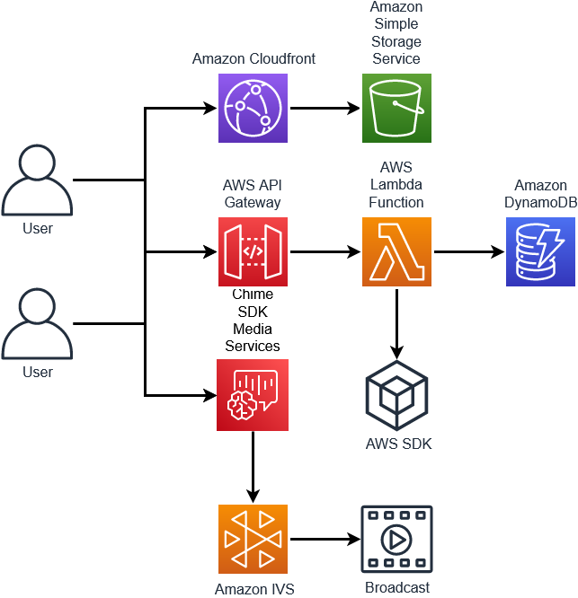
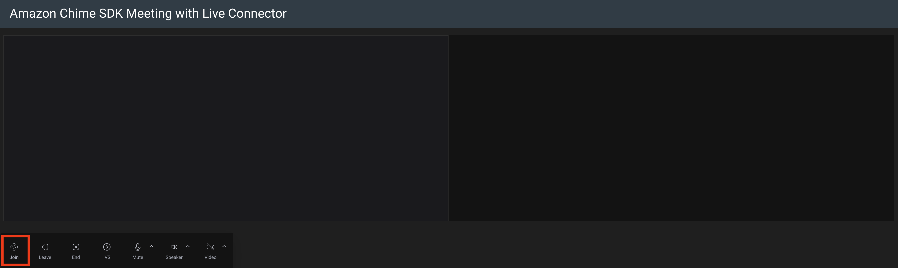
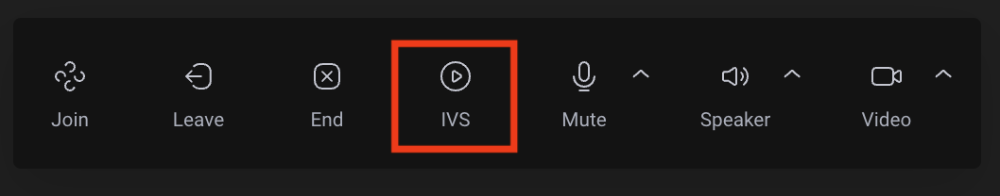
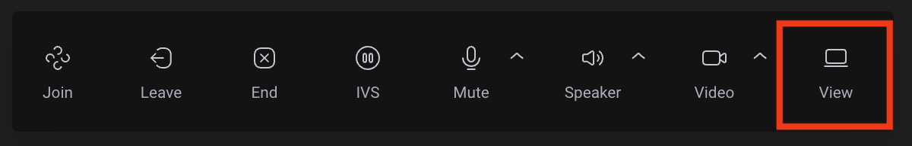

# Amazon Chime SDK Meeting with Live Connector

This demo will deploy several components to be used to create an Amazon Chime SDK Meeting and use the [Amazon Chime SDK media live connector](https://docs.aws.amazon.com/chime-sdk/latest/dg/media-pipelines.html) to stream to a Real-Time Messaging Protocol (RTMP) endpoint. In this demo, we will use [Amazon Interactive Video Service](https://docs.aws.amazon.com/ivs/latest/userguide/what-is.html) as the RTMP endpoint.

## Overview



This demo will use serverless components to host a React based site the user is able to interact with through an AWS API Gateway to an AWS Lambda function. This AWS Lambda function will control the meeting through calls to the [AWS SDK](https://docs.aws.amazon.com/AWSJavaScriptSDK/v3/latest/index.html).

### Creating and Joining an Amazon Chime SDK Meeting

Once deployed, you can click the `Join` button to join the meeting.



This will invoke the included AWS Lambda function to create and join the meeting.

```typescript
async function meetingRequest() {
  const currentMeetings = await checkForMeetings();
  if (currentMeetings) {
    for (let meeting of currentMeetings) {
      if (meeting.joinInfo.Attendee.length < 2) {
        console.log(`Adding an attendee to an existing meeting: ${meeting.meetingId}`);
        const attendeeInfo = await createAttendee(meeting.meetingId);
        console.log(`attendeeInfo: ${JSON.stringify(attendeeInfo)}`);
        meeting.joinInfo.Attendee.push(attendeeInfo.Attendee);
        await putMeetingInfo(meeting.joinInfo);

        const responseInfo = {
          Meeting: meeting.joinInfo.Meeting,
          Attendee: attendeeInfo.Attendee,
        };

        response.statusCode = 200;
        response.body = JSON.stringify(responseInfo);
        console.info('joinInfo: ' + JSON.stringify(response));
        return response;
      }
    }
  }
```

This function will first check to see if there are any existing meetings. If there is, it will look for a meeting with fewer than two people. If there is one, an attendee will be created in the meeting and the information passed back to the user.

```typescript
  const meetingInfo = await createMeeting();
  if (meetingInfo && meetingInfo.Meeting && meetingInfo.Meeting.MeetingId) {
    const attendeeInfo = await createAttendee(meetingInfo.Meeting.MeetingId);
    if (attendeeInfo && attendeeInfo.Attendee) {
      const joinInfo: JoinInfo = {
        Meeting: meetingInfo.Meeting,
        Attendee: [attendeeInfo.Attendee],
      };
      await putMeetingInfo(joinInfo);

      const responseInfo = {
        Meeting: meetingInfo.Meeting,
        Attendee: attendeeInfo.Attendee,
      };

      response.statusCode = 200;
      response.body = JSON.stringify(responseInfo);
      console.info('joinInfo: ' + JSON.stringify(response));
      return response;
    }
  }
  response.statusCode = 503;
  return response;
}
```

If there is not a meeting available, a new meeting and attendee will be created. This information is captured and returned to the user that will be used to join the meeting.

### Creating an IVS Channel and Amazon Chime SDK media live connector pipeline

Once the meeting has started, the [Amazon Chime media live connector stream](https://docs.aws.amazon.com/chime-sdk/latest/dg/connector-pipe-config.html) can be created.



```typescript
async function createStream(meetingId: string) {
  const createChannelResponse: CreateChannelCommandOutput =
    await ivsClient.send(new CreateChannelCommand({ latencyMode: 'NORMAL' }));
  console.log(
    `createChannelResponse: ${JSON.stringify(createChannelResponse)}`,
  );
  if (
    createChannelResponse &&
    createChannelResponse.channel &&
    createChannelResponse.streamKey
  ) {
    createMediaLiveConnectorPipelineCommandInput!.Sources![0]!.ChimeSdkMeetingLiveConnectorConfiguration!.Arn = `arn:aws:chime::${awsAccountId}:meeting:${meetingId}`;
    createMediaLiveConnectorPipelineCommandInput!.Sinks![0]!.RTMPConfiguration!.Url = `rtmps://${createChannelResponse.channel.ingestEndpoint}:443/app/${createChannelResponse.streamKey.value}`;

    console.log(
      `CreateMediaLiveConnectorPipelineCommandInput: ${JSON.stringify(
        createMediaLiveConnectorPipelineCommandInput,
      )}`,
    );
```

The first step is to [create an IVS Channel](https://docs.aws.amazon.com/ivs/latest/userguide/getting-started-create-channel.html). We will use the information from the response when creating the media live connector pipeline in the next step.

```typescript
const createPipelineResponse: CreateMediaLiveConnectorPipelineCommandOutput =
  await chimeSdkMediaPipelineclient.send(
    new CreateMediaLiveConnectorPipelineCommand(
      createMediaLiveConnectorPipelineCommandInput,
    ),
  );
console.log(
  `CreatePipelineResponse: ${JSON.stringify(createPipelineResponse)}`,
);
```

Using the information from the IVS Channel creation, we will use [`CreateMediaLiveConnectorPipelineCommand](https://docs.aws.amazon.com/AWSJavaScriptSDK/v3/latest/clients/client-chime-sdk-media-pipelines/classes/createmedialiveconnectorpipelinecommand.html) to create the Amazon Chime SDK media live connector. The source for this media live connector will be the previously created meeting. The sink for this media live connector will be the RTMPS endpoint of the IVS channel.

```typescript
    if (
      createPipelineResponse &&
      createPipelineResponse.MediaLiveConnectorPipeline
    ) {
      const getStreamResponse: GetStreamCommandOutput | null =
        await checkForStream(createChannelResponse);
      console.log(`getStreamResponse: ${JSON.stringify(getStreamResponse)}`);
      if (getStreamResponse && getStreamResponse.stream) {
        response.body = JSON.stringify({
          mediaPipelineId:
            createPipelineResponse.MediaLiveConnectorPipeline.MediaPipelineId,
          playbackUrl: getStreamResponse.stream.playbackUrl,
        });

        response.statusCode = 200;
        console.info('streamInfo: ' + JSON.stringify(response));
        return response;
      }
    }
  }
  response.statusCode = 503;
  return response;
}
```

Once the media live connector has been configured to use the IVS channel, we can use [`GetStreamCommand`](https://docs.aws.amazon.com/AWSJavaScriptSDK/v3/latest/clients/client-ivs/classes/getstreamcommand.html) to get the `playbackUrl` that will be used to view the IVS stream. This information is passed back to the user so that they can view the broadcast.



### Service-Linked Role

Included in this demo is a service-linked role that allows the pipelines to access Amazon Chime SDK meetings.

```typescript
new CfnServiceLinkedRole(this, 'mediaPipelinesSLR', {
  awsServiceName: 'mediapipelines.chime.amazonaws.com',
});
```

## Components Deployed

- AWS Lambda Function
- Amazon DynamoDB Table
- Amazon Cloudfront Distribution
- Amazon Simple Storage Service (S3) Bucket
- Amazon API Gateway

## Deployment

To deploy this demo:

```bash
yarn launch
```

The output of this deployment will include an Amazon Cloudfront Distribution that can be used. This demo also includes the ability to run locally:

```bash
cd site
yarn && yarn run start
```

## Clean Up

To remove the components created:

```bash
yarn cdk destroy
```

## Note on Repo Update

Previously, this repo contained a much different deployment based on an older technique. That repo is still available in the `master` branch. Going forward, updates will be applied to the `main` branch using the new features.
